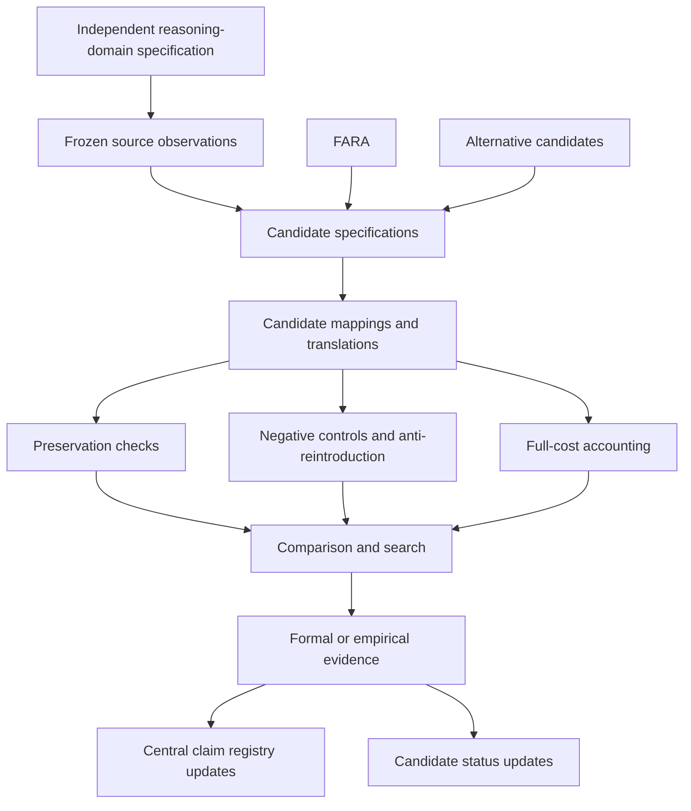

# Architecture-Neutral Research Engine Blueprint

## Status

Accepted planning blueprint only. This document does not implement the discovery engine or establish a scientific result.

## Design constraint

The independent reasoning-domain specification must not depend on FARA. FARA enters only as one candidate in the candidate-specification layer.

## Dependency graph

Evidence flows into claims. Claims do not determine evidence.

## 1. Independent domain specification

**Purpose:** Define one or more classes of reasoning systems without candidate-native primitives.

**Existing components:** external observation contract standard; boundary-discovery program.

**Missing components:** accepted architecture-neutral reasoning definition; independently justified non-reasoning criteria; scoped source-system schemas.

**Inputs:** independently described source processes.

**Outputs:** frozen domain and observable specifications.

**Trust boundary:** must be reviewed for candidate neutrality. Candidate designers may propose it but may not be the sole confirmatory authority.

**Can support:** definition of theorem and experiment domains.

**Cannot support alone:** existence, universality, necessity, or minimality.

## 2. Candidate specification layer

**Purpose:** Store versioned candidate architectures and vocabularies.

**Existing components:** FARA theory; CRE-003/CRE-004 candidate artifacts; candidate registry.

**Missing components:** a full candidate-neutral formal schema and compiler contract.

**Inputs:** explicit candidate specifications.

**Outputs:** frozen candidate versions eligible for mapping.

**Trust boundary:** material post-exposure changes require new versions.

## 3. Observation and preservation layer

**Purpose:** State what must survive representation independently of candidate terminology.

**Existing components:** external observation contract; six-dimensional preservation protocol.

**Missing components:** preservation-basis investigation testing whether the current dimensions are sufficient, redundant, independent, or incomplete.

## 4. Mapping and translation layer

**Purpose:** Record candidate mappings without silent repair.

**Existing components:** comparative representation experiments and deterministic replay infrastructure.

**Missing components:** general candidate-neutral mapping schema and synthesis interface.

## 5. Negative-control and anti-reintroduction layer

**Purpose:** Reject lookup tables, hidden interpreters, metadata smuggling, history erasure, dependency collapse, semantic labels without operational commitments, and equivalent concealed primitives.

**Existing components:** negative-control suite and primitive necessity/reintroduction protocol.

**Missing components:** executed prospective controls across multiple candidates.

## 6. Cost and comparison layer

**Purpose:** Keep vocabulary cost separate from representation cost and report Pareto relations or explicit tradeoffs.

**Existing components:** comparative cost model.

**Missing components:** candidate-neutral machine-readable cost records and deterministic dominance checks.

## 7. Search layer

**Purpose:** Generate or enumerate source systems, candidates, mappings, ablations, and counterexamples.

**Existing components:** bounded experiment machinery only.

**Missing components:** exhaustive small-system generator, architecture generator, mapping search, minimal counterexample extraction, and search-space accounting.

**Restriction:** the search space must not be derived from FARA's primitives alone.

## 8. Formalization layer

**Purpose:** Prove scoped representation, lower-bound, independence, equivalence, and impossibility results.

**Existing components:** Lean and executable mechanization at registered scopes.

**Missing components:** architecture-neutral domain formalization and nontrivial theorem statements.

**Restriction:** placeholder inhabitation does not count as faithful representation.

## 9. Evidence and decision layer

**Purpose:** Connect immutable results to central claims and candidate statuses.

**Existing components:** central claim registry, research gates, evidence standards, claim ledger.

**Missing components:** candidate-registry consistency validation and final decision procedures for replacement, equivalence, boundedness, or no-go results.

## Independence rules

- Internal isolated implementations establish implementation robustness only.
- Independent replication requires provenance at the level declared by the evidence standard.
- Candidate authors may implement exploratory machinery, but confirmatory evaluation must satisfy the frozen independence level.

## Next scientific dependency

The first post-reset scientific PR must construct and freeze an architecture-neutral definition or specification of the reasoning-system class to be tested. It must not derive required structure from FARA.
