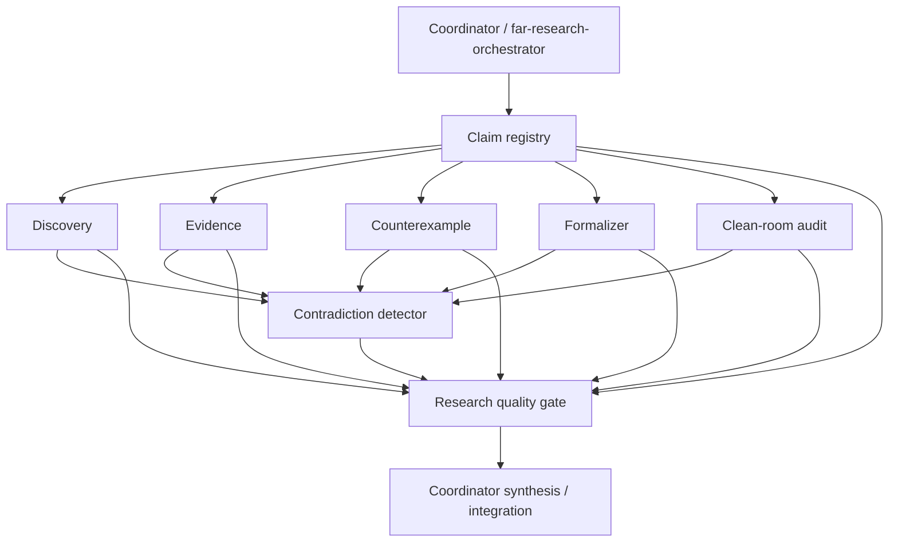

# FAR Subagent Execution Protocol

## Status

Provisional execution architecture. This document defines how agent runtimes may execute Project FAR research work. It does not amend FAR theory, promote any claim, establish external independence, or make model agreement evidence.

Protocol identifier: `FAR-SUBAGENT-1.0`.

Implementation: `tools/far_subagent_orchestrator.py`.

## Purpose

Project FAR already separates discovery, evidence, formalization, counterexample search, contradiction review, clean-room audit, and acceptance. A single long model context can blur those boundaries by carrying conclusions and assumptions from one stage into the next.

`FAR-SUBAGENT-1.0` makes those boundaries executable:

- the coordinator freezes a directed acyclic task graph;
- specialist subagents receive only the context needed for their task;
- clean-room lanes receive target claims without prior verdicts or preferred conclusions;
- specialist outputs use typed, immutable reports;
- contradictory findings remain explicit until an adjudicator resolves them;
- failed or blocked work propagates forward as a gate failure;
- I-class material cannot by itself justify acceptance;
- repository mutation and final integration remain coordinator-owned.

The protocol reuses the existing FAR skill inventory. It does not create a second research methodology.

## Control boundary

The coordinator owns:

1. task-graph construction and validation;
2. context filtering;
3. deterministic sandbox identifiers;
4. dependency scheduling;
5. report-binding checks;
6. conflict detection;
7. promotion gates;
8. final synthesis and any repository writes.

Specialist subagents are read-only. They may search, inspect, reason, formalize, and return reports. They do not merge, promote, rewrite canonical state, or mutate shared repository files.

This is deliberate. Parallel agents writing the same mutable state create order-dependent behavior and make provenance difficult to reconstruct.

## Specialist roles

| Role | Existing FAR skill | Function |
|---|---|---|
| Claim registry | `far-claim-registry` | Decompose the target into stable atomic claims and scopes. |
| Discovery | `far-discovery-engine` | Search broadly for material evidence and competing explanations. |
| Evidence | `far-evidence-ledger` | Record provenance-bearing support and counterevidence. |
| Counterexample | `far-counterexample-hunter` | Seek falsifiers, boundary failures, and narrower surviving claims. |
| Formalizer | `far-formalizer` | Expose premises, inference structure, assumptions, and failure conditions. |
| Clean room | `far-clean-room-auditor` | Evaluate frozen target claims without prior FAR verdicts or construction-session synthesis. |
| Contradiction | `far-contradiction-detector` | Preserve and adjudicate collisions among specialist findings. |
| Quality gate | `far-research-quality-gate` | Apply evidence, acceptance, and closure constraints to the frozen packet. |

`far-research-orchestrator` remains the coordinator. The specialist role list is execution routing, not a new authority hierarchy.

## Default graph



The graph is deterministic. Independent nodes may execute concurrently. Dependencies still control information flow.

## Context isolation

Every task declares `context_keys`. The coordinator deep-copies only those named base-context values into the task packet.

Dependency data has three views:

- `claims-only`: stable claim identifiers and exact claim text only;
- `findings`: claim findings without the dependency's recommendation or narrative summary;
- `full`: the complete typed dependency report.

Clean-room tasks are restricted to `claims-only` dependency views. They also reject context keys that explicitly carry prior or preferred conclusions, including `prior_far_verdict`, `prior_target_conclusion`, `preferred_conclusion`, `target_conclusion`, `accepted_answer`, and `synthesis`.

This is a protocol guard, not proof of external independence. Runtime-level hidden state, common model priors, shared infrastructure, or prior exposure outside the supplied task packet remain separate assurance questions governed by the applicable isolation doctrine.

## Execution identity

Each task receives:

- a deterministic `sandbox_id`, derived from the run root and task identifier;
- a SHA-256 `context_digest`, computed over the exact JSON-compatible context packet;
- the expected task identifier and role.

A returned report is rejected if any of those bindings are wrong. This prevents a result from another task or context from being silently attached to the current run.

Distinct task sandboxes reuse the collision check from `tools/adversarial_research_harness.py`.

## Typed report contract

A completed specialist report contains:

- task identifier;
- specialist role;
- execution status;
- bounded summary;
- sandbox identifier;
- context digest;
- zero or more atomic findings;
- optional acceptance/rejection/uncertain recommendation;
- optional explicit conflict resolutions.

Each atomic finding contains:

- stable `claim_id`;
- exact claim text;
- evidence class `P`, `C`, `A`, or `I`;
- disposition: supports, contradicts, or uncertain;
- rationale;
- source provenance where applicable;
- residual uncertainty.

P- and C-class findings require provenance at object construction time.

## Conflict policy

A cross-agent conflict exists when completed reports assign both `supports` and `contradicts` to the same `claim_id`.

The coordinator never averages conflicting reports into a score.

A conflict becomes procedurally resolved only when an explicit `ConflictResolution` selects a decisive disposition. An `uncertain` resolution preserves the conflict and continues to block promotion. Multiple incompatible resolutions remain unresolved.

The conflict record retains the supporting and contradicting task identifiers even after adjudication.

## Failure propagation

Runner exceptions become failed reports. A task whose dependency failed or was blocked becomes blocked and is not executed.

Promotion fails closed if any of the following occurs:

- a task fails;
- a task is blocked;
- a required quality-gate task is missing or incomplete;
- a cross-agent conflict remains unresolved;
- any report recommends acceptance without at least one non-I supporting finding.

A failed promotion gate does not erase the research packet. The coordinator may still report the failure, uncertainty, negative result, or discovered defect. It may not represent the run as accepted.

## Runtime adapters

The protocol is provider-neutral. A runtime adapter implements the `SubagentRunner` callable contract.

Suitable runtimes include:

- a managed agent runtime that can create independent subagent contexts;
- the OpenAI Agents SDK using manager-controlled specialists;
- separate Responses API calls controlled by application code;
- deterministic local test doubles.

When OpenAI hosted multi-agent primitives are available, the root agent may use them as the execution transport. FAR's frozen DAG, context rules, report schema, and gates remain controlling. Model-directed delegation does not authorize the model to add, remove, reorder, or silently merge required FAR stages.

When a runtime does not expose true subagents, the same task graph may be executed serially through an adapter for functional testing. Such a run must not be described as independent merely because it followed the subagent schema.

## OpenAI mapping

As of September 2026, OpenAI exposes three relevant runtime surfaces:

- Responses API Multi-agent: hosted spawning, messaging, waiting, and subagent contexts;
- Agents API: an OpenAI-managed Codex harness with sessions, orchestration, compaction, recovery, tools, and multi-agent execution;
- Agents SDK: application-owned orchestration with agents, tools, handoffs, and manager-style agents-as-tools.

For FAR, deterministic orchestration remains in application/repository logic because protocol order and isolation are part of the research method. OpenAI runtime features are execution mechanisms.

No OpenAI package is therefore required by the core FAR test suite.

## Use rules

Use subagents when work can be partitioned into bounded research lanes whose context should remain separate or whose execution can safely occur in parallel.

Keep work in the coordinator when:

- the next operation depends directly on the immediately preceding result;
- multiple agents would contend for the same mutable file or repository state;
- the task is too small to justify another context;
- a required protocol step must remain deterministic and centrally controlled.

Do not call same-session role-play a clean-room audit. Do not infer independence from different task names, sandbox IDs, or model calls alone.

## Inspection

Print the default protocol graph as JSON:

```bash
python tools/far_subagent_orchestrator.py \
  --objective "Evaluate a bounded FAR research question"
```

The output lists protocol version, coordinator, specialist skills, dependencies, context policy, clean-room status, completion criteria, and exclusions.

## Verification requirements

The implementation is not complete unless tests cover at least:

1. clean-room conclusion leakage rejection;
2. claims-only dependency projection;
3. distinct per-task sandbox identities;
4. deterministic DAG ordering under sequential and parallel execution;
5. unresolved contradiction failure;
6. explicit decisive conflict resolution;
7. uncertain adjudication preserving the block;
8. I-only acceptance rejection;
9. runner failure and downstream blocking;
10. task-graph cycle and missing-context rejection;
11. report execution-binding validation.

Repository-wide CI remains controlling for compatibility with the rest of Project FAR.
