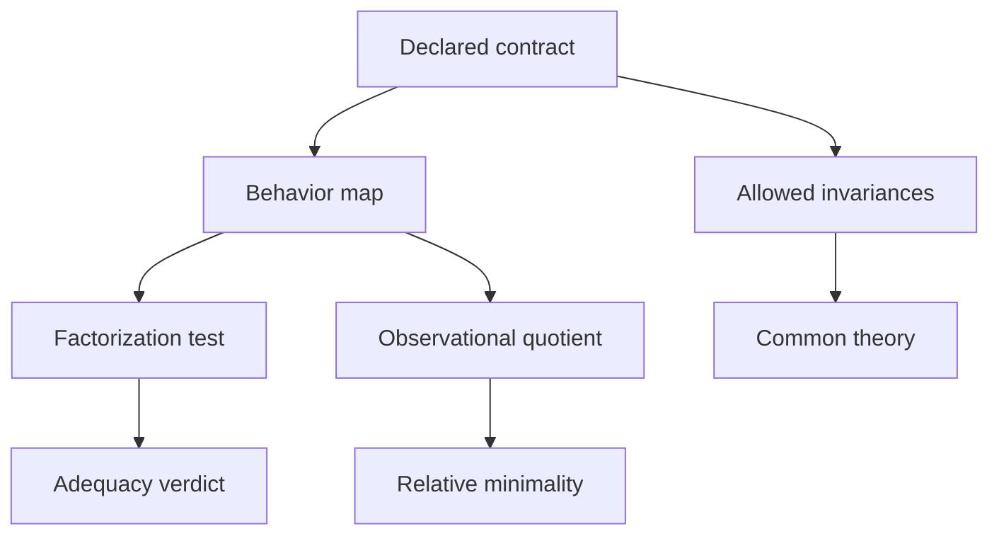

# Project FAR Core Theory v1.0

## Contract-Relative Representation, Sufficiency, and Audit

**Status:** **TERMINAL—THEORY CLOSED** (internal deductive result; not independently reviewed)

**Date:** 2026-08-24

**Terminal verdict:**

> **NONTRIVIAL CONTRACT-FREE MINIMAL ARCHITECTURE IS IMPOSSIBLE; CONTRACT-RELATIVE SUFFICIENCY AND A UNIQUE MINIMAL OBSERVATIONAL QUOTIENT ARE PROVED.**

**Authority boundary:** This is a detached closure artifact produced without modifying the
repository. It becomes canonical Project FAR repository authority only through the project's
governed integration process. That boundary affects repository status, not the validity of the
proofs stated here.

This document closes the broad theoretical question that motivated Project FAR. It does not
claim that FARA's prior primitive candidates form a universal ontology, that the frozen UPP
derivation was sound, or that a finite comparison panel discovered a unique architecture.
Those stronger claims do not survive audit.

The positive result is narrower and exact: once a comparison contract declares which cases,
tests, contexts, outcomes, transformations, and losses matter, representation sufficiency is a
factorization property. The contract induces an observational equivalence relation and a
canonical quotient. That quotient is the unique least-informative exact representation, up to
isomorphism, for that contract. Change the contract and the quotient can change. Without the
contract, “representation-independent,” “sufficient,” “minimal,” and “same reasoning” have no
determinate mathematical content.

Project FAR therefore closes as an **audit and contract discipline**, not as a discovered
universal inventory of reasoning primitives.

---

## 0. Executive disposition

### 0.1 What is proved

1. **Exact representation sufficiency is equivalent to factorization.** A representation is
   sufficient exactly when no two cases that it identifies have different declared observable
   behavior.
2. **Every fixed exact comparison contract induces a canonical minimal quotient.** It is unique
   up to bijection/isomorphism and is a quotient of every other sufficient representation.
3. **No representation can be simultaneously minimal across the unrestricted class of
   observation contracts on a nontrivial domain.** A constant observer requires one
   equivalence class; a fully discriminating observer requires one class per case.
4. **Invariance is antitone in the allowed re-representation class.** The more transformations
   a claim must survive, the less nontrivial invariant content remains.
5. **Unconstrained encoding trivializes universality.** Any structure can be transported into a
   sufficiently expressive host; that proves host capacity, not native shared architecture.
6. **Primitive and operator counts are not representation invariants.** Relations can be
   reified, tagged, split, or combined; finite operator families can be combined into one
   tagged universal operator and recovered again.
7. **Finite heterogeneous panels cannot establish open-domain universality.** They can establish
   only panel-relative results unless a separate proof covers every untested member.
8. **A complete common theory exists only relative to a fixed language, interpretation profile,
   frame, and target class.** Without those indices, “common structure” is underdetermined.
9. **Determinate absence and epistemic Unknown must remain distinguishable whenever a declared
   test distinguishes them.** No new global truth value is forced; a local typed result is
   sufficient.
10. **Canonical FARA Ω is derived.** Under its current definition it is a materialized
    representation of classifications produced by a calculus, not an independent primitive or
    cause of consequences.

### 0.2 What is rejected

- A contract-free, nontrivial, globally minimal reasoning architecture.
- A universal or irreducible basis consisting of Construct, Differentiate, Restrict, Resolve,
  or any fixed finite number of named operators.
- Primitive or irreducible status for Ω.
- The inference from successful encoding to native common structure, necessity, uniqueness, or
  minimality.
- The inference from eleven systems, 88 extracted items, or any other finite panel to an
  unrestricted universal theory.
- The frozen UPP theorem as established. Its accepted cross-audit already records that the
  derivation is defective over part of its stated domain.
- The claim that FAR protocols logically follow from FARA, or that FARO follows necessarily
  from FARA/FAR. They remain chosen downstream methods and operations.

### 0.3 What remains valid

- The identity-bearing many-sorted FARA kernel remains a defensible **Project FAR v1.0
  engineering standard** for finite, explicit, auditable records. It is not globally unique or
  minimal.
- Search-State Sufficiency (SSS) remains a correct bounded illustration of the factorization
  criterion, subject to its stated representation and decoder classes.
- The E1 irreflexivity kernel remains a profile-relative result of the independent experiment.
  It is not a universal reasoning law.
- Explicit scope, provenance, Unknown, loss, and failure reporting remain governance
  requirements justified by Project FAR's audit objective. They are not metaphysical
  primitives.

### 0.4 What “finished” means here

The core theoretical question is closed because both branches have terminal answers:

- **Contract-free branch:** negative/impossibility result.
- **Contract-relative branch:** positive factorization and minimal-quotient theory.

Mechanization, independent review, domain-specific contracts, applications, and software can
increase assurance or utility. They do not change the logical content of the core theorem and
are not hidden conditions for calling the theory complete.

---

## 1. The exact research question

The governing question is:

> What representation-independent, or appropriately relativized, common structure exists
> across heterogeneous reasoning and investigation systems, and what is the strongest minimal
> theory justified by the evidence and proofs?

The answer has two parts.

1. **There is no determinate contract-free answer.** Representation independence requires a
   specified class of admissible transformations. Sufficiency requires specified observations
   or tasks. Minimality requires a specified preservation objective and, for implementation
   cost, a specified cost order. None is supplied merely by naming heterogeneous systems.
2. **There is an exact relative answer.** A declared family of tests induces behavior,
   indistinguishability, a quotient, and a factorization test. This is the strongest general
   structure that survives without smuggling a preferred ontology or operator basis into the
   premises.

This result is a boundary theory. It identifies what must be fixed before substantive common
structure is a meaningful target, proves the canonical object after those choices are fixed,
and proves why no single canonical object exists before they are fixed.

---

## 2. Formal vocabulary

The following are **formal roles**, not claims about metaphysical primitives.

### 2.1 Local comparison contract

A local exact comparison contract is a tuple

\[
C=(X,T,V,\operatorname{obs}).
\]

- \(X\) is a set of **cases**. A case may be a state, history, proof-search frontier, model,
  probability structure, argumentation framework with active context, execution, or any other
  fully specified situation relevant to the investigation.
- \(T\) is a set of admissible **tests or contexts**. A test may be a query, continuation,
  intervention, action sequence, proof obligation, decision problem, or observation protocol.
- \(V\) is a typed **outcome space**.
- \(\operatorname{obs}:T\times X\to V\) gives the outcome of applying a test to a case.

If the native semantics is partial, nondeterministic, or probabilistic, it is not forced into a
Boolean. Instead:

- partiality is totalized with explicit typed outcomes such as `undefined`, `not-applicable`,
  or `unknown`;
- nondeterministic outcomes may live in \(\mathcal P(Y)\);
- probabilistic outcomes may live in a space of probability measures;
- multi-extension argumentation outcomes may be sets or families of extensions;
- graded outcomes may live in an ordered or metric space.

The key rule is that outcome distinctions are preserved whenever a declared test can observe
them.

### 2.2 Behavior map

The contract's complete exact behavior map is

\[
\beta_C:X\longrightarrow V^T,
\qquad
\beta_C(x)(t)=\operatorname{obs}(t,x).
\]

This packages every declared test outcome for a case. It does not assert that the native
system internally stores such a function.

### 2.3 Representation and decoder

A representation is a map

\[
\rho:X\to R.
\]

It is **exactly sufficient for \(C\)** when a decoder

\[
d:\rho[X]\to V^T
\]

exists such that

\[
\beta_C=d\circ\rho.
\]

Only the image \(\rho[X]\) matters. No arbitrary behavior outside the represented image is
required.

### 2.4 Observational equivalence and quotient

Define

\[
x\sim_C y
\quad\Longleftrightarrow\quad
\forall t\in T,\ \operatorname{obs}(t,x)=\operatorname{obs}(t,y).
\]

Equivalently, \(\sim_C=\ker(\beta_C)\). The contract-relative observational quotient is

\[
Q_C=X/{\sim_C},
\]

with quotient map \(q_C:X\to Q_C\), \(q_C(x)=[x]_C\).

### 2.5 Dynamic and compositional contracts

When future behavior matters, \(T\) must contain the allowed continuations, actions,
interventions, or contexts. If \(A\) is a family of unary actions on \(X\), require semantic
test closure: for every \(t\in T\) and \(a\in A\), there is a test denoted \(t\circ a\in T\)
such that

\[
\operatorname{obs}(t,a(x))=\operatorname{obs}(t\circ a,x)
\quad\text{for all }x\in X.
\]

Then \(\sim_C\) is action-compatible and the actions descend to the quotient. Multi-argument
operations use the corresponding one-hole context closure.

This is how the same formal core covers traces, state transitions, proof continuations,
interventions, and context-dependent argument defeat without assuming that they share one
native state type.

### 2.6 Cross-system comparison contract

For a family \(\{S_i\}_{i\in I}\), a cross-system contract must additionally fix:

- the target class \(I\);
- a comparison language/signature \(L\);
- an interpretation/profile \(J_i\) for each target;
- an interface frame \(\Gamma\) containing only constitutive typing and declared definitions;
- admissible re-representations or morphisms \(G\);
- any cost or approximation order used for claims stronger than exact information minimality.

Without these data, “same structure,” “common theory,” “lossless,” and “minimal” are not
well-formed predicates.

---

## 3. Formal premises and admission principles

### 3.1 Formal premises (“axioms” of the model)

These are not empirical claims about cognition. They state the mathematical setting in which
Theorems 1–14 are proved.

- **A1 — Set presentation:** cases, tests, representations, and outcomes are sets at the level
  of the core theory.
- **A2 — Explicit semantics:** the observation relation is represented as a total function
  after partiality, nondeterminism, and probability are moved into typed outcome values.
- **A3 — Fixed-contract evaluation:** adequacy and minimality are evaluated only after the
  tests and outcome distinctions are fixed.
- **A4 — Extensional exactness:** exact adequacy means equality of every declared test outcome;
  approximate adequacy requires an additional metric/order/loss contract and is outside the
  exact theorems unless explicitly supplied.
- **A5 — Declared invariance:** representation independence is evaluated only against an
  explicitly named transformation or morphism class.

### 3.2 Admission principles

These principles govern valid uses of the theory. They are explicit methodological premises,
not alleged laws of all reasoning.

#### P1 — Scope closure

Every universal quantifier names its domain. “All reasoning systems” is invalid unless the
membership rule for that class is explicit and every proof obligation ranges over it.

#### P2 — Parameter completeness

Every parameter capable of changing a declared consequence belongs in the case, test, or
calculus specification. An omitted active context, semantics choice, query mode, decision
loss, threshold, execution choice, or history is a hidden variable, not a property of the
representation.

#### P3 — Outcome separation

Distinct declared outcomes remain distinct. In particular, determinate absence is not
epistemic Unknown, inapplicability is not falsity, and a set of permissible extensions is not
one arbitrarily selected extension.

#### P4 — Sufficiency by factorization

No representation is called lossless or sufficient merely because examples can be encoded.
It must satisfy the factorization criterion for the declared behavior.

#### P5 — Equivalence before spelling

Token names and surface syntax are not semantic identities. Identity is evaluated under the
contract's admitted isomorphisms or equivalences.

#### P6 — No universality by finite induction

A finite panel establishes only a result over that panel unless a separate theorem covers the
remainder of the named domain.

#### P7 — No minimality without an order

Information minimality is supplied by the quotient theorem below. Any stronger claim about
size, runtime, cognitive simplicity, explanatory power, or implementation cost requires a
declared preorder or cost function. Different cost orders can have different optima.

#### P8 — Provenance does not transfer truth

Repository acceptance, implementation, repeated model agreement, or successful validation
does not promote a theorem beyond the exact premises that were proved.

---

## 4. Core theorems

### Theorem 1 — Exact factorization criterion

For a fixed contract \(C\) and representation \(\rho:X\to R\), the following are equivalent:

1. \(\rho\) is exactly sufficient for \(C\);
2. \(\ker(\rho)\subseteq\ker(\beta_C)\);
3. whenever \(\rho(x)=\rho(y)\), every declared test gives the same outcome on \(x\) and
   \(y\).

#### Proof

If \(\beta_C=d\circ\rho\) and \(\rho(x)=\rho(y)\), then

\[
\beta_C(x)=d(\rho(x))=d(\rho(y))=\beta_C(y).
\]

Hence \(\ker(\rho)\subseteq\ker(\beta_C)\).

Conversely, assume the kernel inclusion. Define

\[
d(\rho(x)):=\beta_C(x).
\]

This is well-defined: if \(\rho(x)=\rho(y)\), the kernel inclusion gives
\(\beta_C(x)=\beta_C(y)\). Therefore \(\beta_C=d\circ\rho\). ∎

#### Consequence

The decisive counterexample to any sufficiency claim is a **collision**:

\[
\rho(x)=\rho(y)
\quad\text{and}\quad
\beta_C(x)\ne\beta_C(y).
\]

This replaces vague “expressive loss” language with a complete exact test.

---

### Theorem 2 — Canonical minimal observational quotient

For every exact contract \(C\):

1. \(q_C:X\to Q_C\) is sufficient;
2. for every sufficient \(\rho:X\to R\), there is a unique map
   \(h:\rho[X]\to Q_C\) such that
   \[
   q_C=h\circ\rho;
   \]
3. a sufficient representation is least-informative exactly when its kernel equals
   \(\sim_C\); every such representation is isomorphic to \(Q_C\);
4. in the finite case, every sufficient representation has at least \(|Q_C|\) represented
   values, and \(Q_C\) attains that bound.

#### Proof

Define \(\bar\beta([x]_C)=\beta_C(x)\). This is well-defined by the definition of
\(\sim_C\), and \(\beta_C=\bar\beta\circ q_C\), so \(q_C\) is sufficient.

If \(\rho\) is sufficient, Theorem 1 gives \(\ker(\rho)\subseteq\sim_C\). Define

\[
h(\rho(x))=[x]_C.
\]

It is well-defined for the same reason and satisfies \(q_C=h\circ\rho\). Uniqueness follows
because every element of \(\rho[X]\) is \(\rho(x)\) for some \(x\).

If \(\ker(\rho)=\sim_C\), then \(h\) is bijective. If the inclusion is strict, \(\rho\)
retains distinctions the contract cannot observe, so it is not least-informative. The finite
cardinality claim follows from the surjection \(h:\rho[X]\twoheadrightarrow Q_C\). ∎

#### Exact scope

This is information minimality, not a theorem about shortest code, fastest implementation,
lowest cognitive burden, or best explanation. Those require an additional cost contract.

---

### Theorem 3 — Dynamic descent under context closure

Let \(A\) be allowed actions on \(X\), and let \(T\) be closed under precomposition with
those actions. Then \(x\sim_C y\) implies \(a(x)\sim_C a(y)\) for every \(a\in A\).
Consequently each action induces a well-defined action

\[
\bar a:Q_C\to Q_C,
\qquad
\bar a([x]_C)=[a(x)]_C.
\]

#### Proof

For every \(t\in T\), closure supplies \(t\circ a\in T\). If \(x\sim_C y\), then

\[
\operatorname{obs}(t,a(x))
=\operatorname{obs}(t\circ a,x)
=\operatorname{obs}(t\circ a,y)
=\operatorname{obs}(t,a(y)).
\]

Thus \(a(x)\sim_C a(y)\), making \(\bar a\) well-defined. ∎

This is the generic reason Myhill–Nerode quotients, behavioral quotients, sufficient-state
representations, and many bisimulation quotients work: the test family is closed under the
relevant continuations.

---

### Theorem 4 — No contract-free nontrivial minimum

Let \(|X|\ge2\), and allow the observation contract to vary. There is no representation of
\(X\) that is least-informative and sufficient for every observation contract on \(X\).

#### Proof

Choose two contracts.

- \(C_0\): \(\beta_0\) is constant. Then \(\ker(\beta_0)=X\times X\), and Theorem 2 says
  the unique minimal quotient has one class.
- \(C_1\): \(\beta_1\) is injective. Then \(\ker(\beta_1)=\Delta_X\), and the unique minimal
  quotient has \(|X|\) classes.

A representation minimal for \(C_0\) identifies every pair. A representation sufficient for
\(C_1\) identifies no distinct pair. No representation can do both when \(|X|\ge2\). ∎

#### Stronger partition form

Every equivalence relation \(E\) on \(X\) is the kernel of its quotient map
\(q_E:X\to X/E\). Therefore every partition of \(X\) is the unique minimal quotient for
some exact observation contract. The domain alone does not select one.

#### Terminal implication

There is no contract-free global answer to “what distinctions does reasoning require?” The
answer is fixed by what the declared tests can distinguish. Choosing all possible tests yields
the identity quotient and preserves everything; choosing no discriminating tests yields one
class and preserves nothing. Neither is an explanatory universal architecture.

---

### Theorem 5 — Invariance antitonicity

Let \(G_1\subseteq G_2\) be two classes of admitted re-representations. If
\(\operatorname{Inv}(G)\) is the collection of properties invariant under every transformation
in \(G\), then

\[
\operatorname{Inv}(G_2)\subseteq\operatorname{Inv}(G_1).
\]

#### Proof

A property preserved under every member of the larger class \(G_2\) is preserved under every
member of its subclass \(G_1\). ∎

#### Terminal implication

“Representation-independent” is incomplete until \(G\) is fixed. Permitting only renamings
preserves much structure. Permitting definitional equivalence, quotients, encodings, dualities,
or arbitrary invertible translations preserves progressively less. There is no single
representation-independent theory before this choice.

---

### Theorem 6 — Transport triviality

Let \(S\) be any structure on carrier \(X\), and let \(e:X\to H\) be an injection into a host
with sufficient capacity. Every operation and relation of \(S\) can be transported to the
image \(e[X]\) so that \(e\) is an isomorphism between \(S\) and the transported image.

#### Proof

For an \(n\)-ary operation \(f\), define

\[
f^e(e(x_1),\ldots,e(x_n))=e(f(x_1,\ldots,x_n)).
\]

For an \(n\)-ary relation \(R\), define

\[
R^e(e(x_1),\ldots,e(x_n))
\Longleftrightarrow
R(x_1,\ldots,x_n).
\]

The inverse of \(e\) on its image reconstructs every operation and relation. ∎

#### Terminal implication

A universal graph, set, relation, category, type theory, database, or program can host many
systems if the encoding and decoder may be chosen freely. That result demonstrates carrier
capacity. It does not demonstrate that the host's scaffolding is natively present in the
targets, is explanatory, is necessary, or is minimal.

---

### Theorem 7 — Primitive-vocabulary noninvariance

Under faithful encoding with explicit tags and a decoder, the number and names of primitive
sorts and relations are not invariant.

#### Construction

- An \(n\)-ary relation can be **reified**: create one occurrence object per tuple and connect
  it to its participants through typed position edges.
- Several relations can be **combined** by adding a relation-type tag to each occurrence.
- One tagged relation can be **split** into separate relations by tag.
- A property can be represented as a unary relation, a value-bearing attribute, a class of
  objects, or a binary relation to a truth/value object.

Each transformation admits a decoder that reconstructs the prior presentation. The same
semantic information therefore has presentations with different primitive counts and kinds.
∎

#### Terminal implication

Object, Property, Relation, Representation, Interpretation, Investigation, and Reasoning
Calculus may be useful schema roles in FARA. Their global primitive independence or
irreducibility cannot be established merely by showing that a fixed FARA schema uses separate
sorts. Such separation is a contract choice.

---

### Theorem 8 — Operator-count noninvariance

Any finite family of operators \(f_1,\ldots,f_n\) can be represented by one tagged operator

\[
U(i,x)=f_i(x)
\]

with arguments encoded into a common tagged domain. Conversely, \(U\) can be split into the
family by fixing the tag. Therefore the number of primitive operators is not invariant under
faithful tagged re-presentation.

#### Proof

The two translations are inverse on the admitted tagged domain:

\[
f_i(x)=U(i,x),
\qquad
U(i,x)=f_i(x).
\]

Different arities are handled by tagged argument tuples. ∎

#### Terminal implication

There is no global theorem that reasoning has exactly three, four, or five irreducible
operators until the theory independently fixes:

- the admissible operator language;
- available tags and data constructors;
- definability and composition rules;
- type discipline;
- a cost model that makes some encodings inadmissible or nonminimal.

Construct, Differentiate, and Restrict remain useful protocol labels. Resolve remains rule
application. None is established as a representation-independent primitive basis.

---

### Theorem 9 — Finite-panel boundary

Let \(D_0\) be a finite proper subset of an open target class \(D\). Observing or proving
\(P(S)\) for every \(S\in D_0\) does not entail \(\forall S\in D\,P(S)\) unless an additional
deductive premise covers \(D\setminus D_0\).

#### Proof

Because \(D_0\ne D\), select \(S^*\in D\setminus D_0\). The finite record is compatible both
with a completion where \(P(S^*)\) holds and one where it fails. The observations on \(D_0\)
do not distinguish them. ∎

#### Terminal implication

The eleven-system independent experiment can establish facts about its eleven frozen targets
and certified profiles. It cannot prove open-domain universality, uniqueness, or global
minimality. Resolving all 86 JOINT-OPEN extensions would strengthen that experiment but would
not remove this theorem.

---

### Theorem 10 — Common theory is profile-relative

Fix a logical signature \(L\), target models \(M_i\) produced by declared interpretation
profiles, and an interface frame \(\Gamma\). The exact common theory is

\[
\mathcal T_{L,J,I}=\bigcap_{i\in I}\operatorname{Th}_L(M_i).
\]

It is invariant under \(L\)-isomorphism of the interpreted targets. Its substantive residue is
the part not already forced by the frame:

\[
\mathcal T_{L,J,I}\setminus\operatorname{Cn}_L(\Gamma).
\]

Changing \(L\), an interpretation \(J_i\), \(\Gamma\), or \(I\) can change the theory.

#### Proof

The intersection is the set of exactly those \(L\)-sentences true in every interpreted target.
First-order truth is invariant under \(L\)-isomorphism. Dependence on the indices follows by
construction; changing an index changes the models or sentences being intersected. ∎

#### Terminal implication

The E1 result

\[
\operatorname{Cn}_{\Gamma}
\{\forall x\,\neg(x\to x)\}\subseteq\mathcal T
\]

is a valid lower bound at its certified profile. It is not an exact, robust, or
profile-independent common theory. The bounded result neither supports nor refutes the
contract-relative core proved here.

---

### Theorem 11 — Omitted-parameter failure

Suppose full cases have the form \((x,c)\), where \(c\) is a context or calculus parameter,
and a representation omits it:

\[
\rho(x,c)=\rho_0(x).
\]

If some declared test satisfies

\[
\operatorname{obs}(t,(x,c_1))\ne
\operatorname{obs}(t,(x,c_2)),
\]

then \(\rho\) is not sufficient.

#### Proof

The two cases have the same representation but different behavior, violating Theorem 1. ∎

#### Applications

- In context-dependent argumentation, active context or its induced defeat function must be
  represented if it changes accepted extensions.
- In Bayesian/causal reasoning, observational and interventional queries cannot be identified
  when they produce different distributions.
- Skeptical versus credulous argument acceptance, grounded versus preferred semantics, and
  alternative decision losses are consequence-affecting parameters.
- A nondeterministic execution choice or history that changes classification belongs in the
  case or outcome, not in an unexplained Ω difference.

---

### Theorem 12 — Determinate absence/Unknown separation

If `absent` and `unknown` are distinct outcomes in \(V\), and two cases produce those outcomes
for some declared test, every sufficient representation must distinguish the cases.

#### Proof

Their behavior maps differ, so identifying them would violate Theorem 1. ∎

#### Terminal implication for UPP

The frozen UPP defect XA-005 does not force a new global fourth truth value. It forces only the
smallest typed representation that keeps determinate absence distinct from Unknown where the
contract observes the difference. An empty certified witness, an applicability predicate, or
a local result type can satisfy the obligation.

---

### Theorem 13 — Ω elimination

Under canonical FARA, let \(z\) be the complete investigation/calculus input, let
\(\operatorname{Class}_\kappa(z)\) be the classifications produced by reasoning calculus
\(\kappa\), and let

\[
\Omega(z)=\operatorname{Rep}(\operatorname{Class}_\kappa(z)).
\]

For any resolution rule \(r\), the consequence is

\[
r(\Omega(z))
=
(r\circ\operatorname{Rep}\circ\operatorname{Class}_\kappa)(z).
\]

Ω is therefore eliminable as an independent semantic primitive.

#### Proof

The displayed equality is function composition. Canonical Ω records the classifications and
does not determine them. Replacing the materialized intermediate with the composite map leaves
every consequence unchanged. ∎

If two investigations share every consequence-affecting input but are assigned different Ω
records, at least one of the following is true:

- a hidden parameter changed;
- a different calculus or execution choice was used;
- the record is incomplete or corrupted;
- Ω contains extra information and is therefore not merely the canonical classification
  representation.

Ω may remain useful as a cache, audit table, interface, or provenance-bearing materialized
view. Operational usefulness is not theoretical irreducibility.

---

### Corollary 13.1 — Resolve is derived

Resolve is application of a declared rule \(r\) to classified candidates. Its semantic content
is already present in the pair \((r,\Omega)\) and the execution event. It is not an independent
representation primitive.

---

### Theorem 14 — Search-state sufficiency is a factorization instance

The SSS results in PR #453 are instances of Theorems 1–3.

- With individual sequents, the rule-induced projected successor relation discards which
  premises belong to the same rule instance/resource partition. Under the stated four uniform
  monotone successor-set decoders, cases with different derivability behavior become
  indistinguishable. Factorization fails.
- A resource-labelled hyperedge retains the joint premise family. The standard AND/OR decoder
  factors derivability through it.
- A frontier multiset internalizes the joint obligation into the state. A binary expansion
  relation on frontiers then suffices for any finitary rule system.

This does not make SSS a universal operator architecture. It shows that adequacy belongs to the
pair **(state type, transition representation)** relative to a decoder/test contract.

### Operator conclusion

The core theory accepts **no domain-general primitive reasoning operators**. Function
composition, kernels/equivalence relations, quotient maps, and factorization are constructions
in the chosen mathematical metalanguage, not claims about operations natively executed by
every reasoning system. Construct, Differentiate, Restrict, and Resolve may be retained as FAR
workflow verbs, but Theorem 8 prevents promoting their count into a representation-independent
minimal basis without a stricter operator contract.

---

## 5. Dependency structure

No FARA primitive list is a premise of these theorems. FARA is one possible representation
target after the contract is fixed.

---

## 6. Semantics across reasoning traditions

The core does not claim that these traditions share one native ontology. It shows how each is
compared without erasing the distinctions that control its consequences.

| Tradition | Cases \(X\) | Tests/contexts \(T\) | Outcomes \(V\) | Typical loss detected by Theorem 1 |
|---|---|---|---|---|
| Formal logic | structures, valuations, theories | formulas or sequents | satisfaction/truth values | collapsing models separated by a formula |
| Proof theory | sequents, proof states, frontiers | rule continuations/derivability queries | derivable, underivable, Unknown | dropping premise grouping or resource split |
| Bayesian reasoning | experiments, distributions, information states | posterior/decision queries under a loss | distributions, risks, actions | using a statistic through which the posterior or risk does not factor |
| Causal reasoning | causal models and contexts | interventions and observations | interventional/observational distributions | identifying \(P(y\mid x)\) with \(P(y\mid do(x))\) |
| Argumentation | framework + active context + semantics | extension/acceptance queries | extension families or acceptance status | omitting context, semantics, or skeptical/credulous mode |
| Model-based reasoning | models, states, histories | predictions, experiments, interventions | predicted observations/trajectories | collapsing states with different future observable behavior |
| Abstract interpretation | concrete semantic states | analysis queries | sound abstract properties | abstraction not sound/complete for the declared property |
| Process semantics | labeled transition systems | traces, failures, tests, bisimulation games | test outcomes/equivalence classes | claiming one process equivalence without selecting observations |
| Category theory | objects/morphisms in a selected category | functorial observations/universal properties | images in the target category | leaving the category/functor unconstrained |
| Type theory | contexts, terms, derivations | typing/equality/normalization judgments | judgments or normal forms | conflating definitional, propositional, and observational equality |

### 6.1 Formal logic and institutions

Institution theory deliberately abstracts a logic through signatures, sentences, models, and a
satisfaction relation invariant under change of notation. That is compatible with this theory:
it fixes the interface needed before logic-independent claims become meaningful. It does not
select one institution or one cross-logic translation from nothing.

### 6.2 Bayesian reasoning and statistical experiments

A statistic is sufficient precisely when the relevant conditional law or decision behavior
factors through it. Blackwell comparison likewise depends on the allowed decision problems and
garblings. There is no loss-independent ranking of information structures.

### 6.3 Abstract interpretation

An abstract domain is evaluated against a concrete semantics and a soundness/precision order.
The Galois connection or related abstraction contract supplies the relation; it is not a
contract-free universal ranking of all representations.

### 6.4 Argumentation

Dung frameworks fix an argument/attack structure but admit multiple semantics. New
context-dependent defeat work makes the same point more sharply: the same attack can succeed
or fail under different contexts. A representation that omits the active context fails exactly
when those contexts induce different declared acceptance outcomes.

### 6.5 Category theory and type theory

Category theory supplies powerful invariant language once objects, morphisms, functors, and
equivalences are selected. Internal-language theorems can prove equivalences between syntax and
semantics for precisely defined bicategories. That is the evidential standard for a real
representation theorem. An unconstrained category or functor can host almost anything and
therefore selects nothing.

### 6.6 Process and model-based reasoning

The linear-time/branching-time spectrum demonstrates that different tests induce different
process equivalences. Coalgebraic behavioral equivalence and recent observable-quotient work
give domain-specific instances of the same quotient pattern. Again, the observation or probe
family is the controlling parameter.

---

## 7. Disposition of Project FAR's prior theory

### 7.0 Canonical layer map after closure

The repository's dependency direction remains unchanged, but each layer now has a precise
theoretical role.

| Layer | Terminal role |
|---|---|
| foundations | ordinary logic, set/function/equivalence machinery, and any declared categorical generalization |
| shared theory | contract-relative behavior, factorization, invariance, quotient, and boundary theorems in this document |
| FARA | selected finite explicit auditable representation target and its identity/provenance commitments |
| FAR | contract freezing, mapping, sufficiency/collision testing, minimization, and loss reporting methodology |
| FARO | execution, materialized views, comparison, audit, and report production |

No downstream layer supplies premises that retroactively prove an upstream primitive inventory.

### 7.1 Primitive and component ledger

| Existing component | Terminal classification | Reason |
|---|---|---|
| Object | **FARA schema role; not globally primitive** | elements can be reified, typed, or encoded under alternative faithful presentations |
| Property | **derived within the accepted kernel** | representable as a unary relation occurrence; other encodings are possible |
| Relation | **FARA schema role; not globally primitive** | relations can be reified as occurrence objects or combined/split by tags |
| Representation | **contract role / schema role** | required to state a representation problem, not proved a native primitive of every target |
| Interpretation | **contract parameter** | fixes how a representation receives meaning; alternative interpretations change results |
| Investigation | **scope aggregate / schema role** | packages objectives, conditions, evidence, and executions; not irreducible globally |
| Reasoning Calculus | **consequence-determining parameter** | must be explicit when it changes classifications; not proved ontologically primitive |
| Construct | **methodological action label** | encodable as a transition/program; no invariant independence proof |
| Differentiate | **methodological action label** | its result is a distinction relative to tests; no invariant independence proof |
| Restrict | **methodological action label** | constraint application; no invariant independence proof |
| Resolve | **derived procedure** | application of a declared resolution rule |
| fourth/fifth operator | **closed as an ill-posed global search** | operator count is not invariant until language/composition/cost are fixed |
| Ω | **derived materialized audit view** | representation of classifications produced elsewhere |
| admissibility classification | **calculus-relative result** | determined by candidate, context, criteria, and calculus |
| reasoning state | **optional representation choice** | sufficient only if declared behavior factors through it |
| transition | **optional dynamic representation** | transition type and arity depend on state type and preserved behavior |
| reasoning trace | **derived view** | ordered event record sufficient for a declared reconstruction purpose |
| fail/Unknown report | **governance-required output** | necessary for Project FAR's audit objective, not a universal metaphysical primitive |
| FARA formal kernel | **accepted v1 engineering standard** | coherent for finite explicit auditable records; no global uniqueness/minimality follows |
| FAR workflow | **independent methodology constrained by this theory** | must freeze contracts and prove/report factorization or loss |
| FARO | **independent downstream execution/reporting layer** | operationally useful; not entailed as a primitive layer |

### 7.2 FARA's accepted formal kernel

The existing identity-bearing many-sorted relational kernel is retained exactly at its stated
scope: finite, explicit, auditable Project FAR v1.0 records. Its disjoint carriers, typed
relations, occurrence identity, event provenance, and acyclic precedence relation are design
commitments selected by eight registered gates.

The new core changes its interpretation:

- It is a **target representation \(R\)**, not the universal source ontology.
- A mapping into it is sufficient only for a declared contract and only when Theorem 1 holds.
- Its sort-preserving relational isomorphism is one admitted equivalence, not the only possible
  behavioral equivalence.
- Its extra distinctions may be intentionally retained for audit even when a smaller
  observational quotient exists. That is a governance/cost choice, not a contradiction.

### 7.3 Ω

The Ω-elimination result closes the prior irreducibility question. Ω should be described as a
materialized classification-and-provenance view. It may be essential to an implementation's
auditability while remaining semantically derived.

The requested LETK+ plus context-dependent-defeat test has the same result. Once the six-valued
evidence assignment, arguments, attacks, active context, defeat function, argumentation
semantics, query mode, bridge calculus, execution choice, and resolution rule are fixed, the
classification map is fixed (or its permitted output set is fixed). A second lawful consequence
cannot differ solely because of Ω. Any such difference is a changed parameter, nondeterministic
execution choice, or bad record. No Ω-only witness pair exists under the canonical definition.

### 7.4 UPP

The frozen UPP terminal theorem is not an established theorem. The accepted 2026-08-13
cross-audit records five defects in the derivation, including the empty-dependency corner,
unpropagated dynamic/history side conditions, status-level composition, and the failure to
distinguish determinate absence from Unknown.

Its correct final status is:

> **Frozen proposition not refuted; frozen derivation defective; theorem not established.**

The registered UPP-SR-001 repair program is no longer required to close the core theory. It may
still be executed as a bounded case study of a specific contract, but even a successful repair
would establish only contract-relative reconstructability. It could not prove a
representation-independent primitive architecture because Theorems 4–8 already delimit that
claim.

The historical terminal adjudication string must remain historical evidence. It must not be
used as current theorem authority.

### 7.5 Independent dialogue-theory experiment / PR #453

PR #453 is open and explicitly noncanonical research evidence. Within that record, the frozen
E0 and successor E1 results remain unchanged:

- E0: internally terminal—blocked.
- E1: internally terminal—fragmented.
- exact common theory, robust theory, profile independence, mathematical maximality, and
  novelty: unresolved in that experiment.
- profile-relative irreflexivity kernel: established as a lower bound at the certified profile.
- SSS: retained as a bounded state/transition sufficiency taxonomy.

This document does **not** pretend to finish E1's 86 open extensions. It proves why completing a
finite matrix cannot answer the broader contract-free question, then supplies the deductive
relative theory that E1 lacked. E1 remains a preserved bounded experiment, not the authority for
the new theorem.

---

## 8. Derived FAR protocol

The theory yields a complete audit protocol. This is FAR's defensible core.

### Step 1 — Freeze the claim and target class

State the exact universal/existential quantifiers, domain membership rule, evidence cutoff, and
nonclaims.

### Step 2 — Freeze the comparison contract

Declare:

- cases;
- tests/contexts/interventions;
- outcome types;
- calculus/semantics/query mode;
- admitted translations and equivalences;
- interface frame;
- approximation and cost order, if any.

### Step 3 — Totalize outcomes without collapsing them

Represent determinate absence, falsity, inapplicability, failure, unresolved, and epistemic
Unknown distinctly whenever a declared test distinguishes them.

### Step 4 — Construct the candidate representation

Map complete cases to the candidate representation. Record every analyst-supplied tag,
encoding, quotient, and hidden auxiliary structure as part of the machinery cost.

### Step 5 — Run the factorization audit

Attempt both directions:

- construct a decoder \(d\) with \(\beta=d\circ\rho\);
- search for a collision \(\rho(x)=\rho(y)\) with \(\beta(x)\ne\beta(y)\).

The first certifies exact sufficiency. The second refutes it. If neither is established, return
OPEN—not NO and not PASS.

### Step 6 — Minimize relative to the objective

- For exact information minimality, compute or characterize \(Q_C\).
- For compositional dynamics, close tests under allowed contexts and quotient by the resulting
  behavioral equivalence.
- For computational or explanatory minimality, declare the cost order and report Pareto or
  incomparability results where no total order is justified.

### Step 7 — Compute common content only after profiles are fixed

Fix \(L\), \(J_i\), \(\Gamma\), and \(I\), then compute or bound
\(\bigcap_i\operatorname{Th}_L(M_i)\). Never treat aliases, type facts, or frame consequences
as substantive discoveries.

### Step 8 — Run reduction and re-presentation attacks

Test whether proposed primitives or operators survive:

- reification;
- tagging/untagging;
- dualization;
- quotient/comprehension change;
- state enrichment;
- decoder enrichment;
- alternative basis;
- cost reversal.

If the result changes, report it as presentation- or contract-relative.

### Step 9 — Issue a typed terminal report

Every terminal report must distinguish:

- PROVED;
- REFUTED;
- OPEN;
- BLOCKED;
- UNDERDETERMINED;
- NOT APPLICABLE;
- HISTORICAL/SUPERSEDED.

It must expose scope, premises, profile, frame, decoder, loss/cost order, evidence, provenance,
falsifiers, and unresolved boundaries.

---

## 9. FARO's legitimate role

FARO is the downstream execution and reporting layer. It may:

- materialize contracts and Ω views;
- run collision searches and decoder checks;
- compare multiple profiles;
- generate proof/failure/Unknown reports;
- preserve provenance and event traces;
- show which conclusions change when the contract changes;
- expose machinery cost and analyst-supplied structure.

FARO does not make the contract objective, prove the FARA schema globally minimal, or turn a
bounded successful mapping into universality.

---

## 10. Counterexamples and stress tests

### CE-1 — Constant versus identity observer

The same two-case domain has a one-state minimal quotient under a constant observer and a
two-state minimal quotient under an injective observer. This refutes contract-free minimality.

### CE-2 — Raw archive universality

Store a byte-perfect description of every target plus a target-specific interpreter. Every
tested system is reconstructable. The “architecture” is universal only because all target
machinery was carried as payload. It establishes capacity, not common structure.

### CE-3 — Reified relations

Turn every relation tuple into an occurrence object with role-labelled participants. A relation
primitive becomes objects plus incidence; the inverse decoder recovers the relation. Primitive
count changed without information loss.

### CE-4 — Tagged universal operator

Replace Construct, Differentiate, Restrict, and Resolve with one tagged operator. Or split one
transition relation into four named operations. Operator count changed without semantic loss.

### CE-5 — Context-dependent defeat

Hold arguments and attacks fixed while changing active context so an attack changes defeat
status. Any representation omitting context identifies cases with different accepted
extensions and fails Theorem 1.

### CE-6 — Observational versus interventional equality

Two causal models may agree on observational distributions and disagree under intervention.
A representation sufficient for observational tests may fail for intervention tests. The
contract, not the data structure alone, determines adequacy.

### CE-7 — MLL projected successor relation

The PR #453 witnesses show that a projected successor truth set cannot support any of the four
uniform monotone successor-set decoders for MLL provability. Hyperedges or frontier states
restore the missing joint-premise information.

### CE-8 — Ω-only divergence

Manually assign different Ω classifications while holding candidate, context, calculus,
semantics, execution choice, and evidence fixed. This is not an independent Ω effect; it is a
corrupted record or an omitted input.

### CE-9 — Finite-panel extension

Add one untested system outside an eleven-target panel that lacks the proposed property. The
panel result remains true and the universal claim fails. No amount of internal panel completion
rules out this extension without a domain theorem.

---

## 11. Hostile audit

### Attack A — “The theory is merely tautological.”

The factorization theorem is elementary. That is not a defect. The earlier project repeatedly
mistook complex encodings and finite campaigns for evidence of a deep universal architecture.
The elementary theorem identifies the actual invariant burden and proves why more substantive
content cannot be extracted without additional premises. Complexity in the proof would not
make the conclusion stronger.

### Attack B — “Use all possible tests and recover an absolute quotient.”

If “all possible tests” includes every set-theoretic discriminator, the quotient is identity
and nothing is abstracted. If it means all physically, computationally, linguistically, or
methodologically admissible tests, admissibility is already a contract choice. The proposal
either becomes trivial or reintroduces relativity.

### Attack C — “The full raw system is universally sufficient.”

Correct: identity storage is sufficient for every extensional test on that system. It is not
minimal for most contracts, not a shared architecture, and not explanatory. Universality by
retaining everything is the transport-triviality result, not a discovery.

### Attack D — “Category theory supplies the universal architecture.”

A category, functor, institution, doctrine, or coalgebraic functor must be selected. With an
unconstrained parameter it hosts many theories but selects no comparison contract. With the
parameter fixed it becomes a powerful relative theory, exactly as this result predicts.

### Attack E — “The observational quotient ignores internal causal structure.”

Only if causal interventions were omitted from \(T\). Add the required interventions and
histories; the quotient refines accordingly. If internal structure matters independently of
every declared test, that importance is a new preservation objective and must be added to the
contract.

### Attack F — “A quotient may be computationally impossible.”

Yes. Theorem 2 is an existence/minimal-information theorem, not an efficient algorithm. A
finite or computable quotient requires extra assumptions. Intractability affects execution,
not the theorem's semantic boundary.

### Attack G — “Approximate reasoning invalidates exact equality.”

It limits the exact quotient's usefulness; it does not refute it. Approximate work requires a
metric, divergence, decision loss, tolerance, or preorder. Those are additional contract
parameters, and different choices can yield different abstractions.

### Attack H — “Primitive distinctions are required for auditability.”

They may be required by Project FAR's chosen audit contract. That establishes conditional
necessity inside that schema, not representation-independent irreducibility. The correct label
is “mandatory engineering field under contract,” not “universal primitive.”

### Attack I — “The new theory was written after seeing the failed experiments.”

Correct. It is not independent replication and makes no novelty claim. Its main results are
deductive and carry explicit proofs. Prior exposure affects discovery provenance, not the
validity of the proofs; it does prevent using this document as independent confirmation of
Project FAR.

### Attack J — “The negative theorem proves no common structure can exist.”

False. It proves that no **contract-free minimal** structure is determined. Rich common
structure may exist after a language, profile, frame, observation family, and equivalence are
fixed. Theorem 10 defines the exact target.

### Hostile-audit verdict

No attack refutes the core theorems. Several attacks narrow their application, and those
boundaries are already explicit. The strongest defensible result remains the terminal verdict
stated at the beginning.

---

## 12. Falsifiers

The theory is not protected by vague wording. The following would defeat or narrow it.

1. **Factorization theorem:** a representation with
   \(\ker(\rho)\subseteq\ker(\beta_C)\) for which no decoder on \(\rho[X]\) exists, or a
   factored representation that identifies behaviorally different cases.
2. **Minimal quotient theorem:** a sufficient representation that does not map onto \(Q_C\),
   or two nonisomorphic least-informative representations under the same exact contract.
3. **No-contract-free-minimum theorem:** one representation proved least-informative for both
   the constant and injective contracts on the same nontrivial \(X\).
4. **Invariance antitonicity:** a property invariant under every transformation in \(G_2\) but
   not under some transformation in its subset \(G_1\).
5. **Ω elimination:** two valid investigations identical in every consequence-affecting input,
   with Ω differing lawfully and the difference changing a permitted consequence without a
   different calculus, execution, record, or hidden parameter.
6. **Primitive/operator noninvariance:** an independently justified equivalence regime under
   which the reification/tagging constructions are admissible yet the primitive/operator count
   is proved invariant. Such a result would be contract-relative and would narrow, not restore,
   the global claim.

The first five falsifiers contradict short explicit proofs. The sixth can succeed only after
fixing the contract that the global primitive claim omitted.

---

## 13. Prior art and novelty disposition

The core mathematical pattern is **not claimed novel**.

- Myhill–Nerode theory supplies canonical minimal quotients relative to continuation tests.
- Sufficient-statistic and Blackwell theories make informativeness relative to parameters,
  decision problems, losses, and garblings.
- Abstract interpretation makes abstraction relative to concrete semantics and a precision
  relation.
- Process semantics supplies multiple observation-induced equivalences rather than one
  context-free process identity.
- Coalgebra characterizes behavior relative to a chosen functor and morphism class.
- Institution theory abstracts logics only after signatures, sentences, models, and
  satisfaction are fixed.
- Internal-language theorems establish syntax/semantics equivalence for exactly specified
  categorical structures.
- Recent work on bounded-interaction quotients and observable world-model quotients explicitly
  proves canonical minimality only after fixing an observer/probe family or controlled
  observation semantics.
- Recent quotient/comprehension duality shows that apparently distinct structural capacities
  can become dual under change of presentation, reinforcing the failure of naive primitive
  counts.

Project FAR's defensible contribution is therefore not ownership of quotient/factorization
mathematics. Its potential contribution is an integrated audit discipline that forces every
cross-system claim to expose its contract, translations, losses, Unknowns, provenance, and
failure boundaries.

**Novelty status:** unresolved; no priority claim.

---

## 14. Known limitations

1. The core theory is exact and extensional. Approximate comparison needs extra metric/order/loss
   structure.
2. The Set-based presentation assumes cases and outcomes can be collected as sets. Class-sized,
   higher-categorical, intensional, or non-well-founded settings require an appropriate
   categorical generalization.
3. Existence of \(Q_C\) does not imply effective computability, decidability, finite rank, or a
   compact basis.
4. A contract may be biased, incomplete, strategically chosen, or normatively unacceptable.
   The theorem makes that choice visible; it does not choose correctly on the user's behalf.
5. Exact equality of probability measures or semantic outcomes may be too strong for practice.
   Approximation thresholds are consequential choices and cannot be inferred universally.
6. The accepted FARA kernel has not been independently validated as the best engineering
   implementation under a real external cost model.
7. The theory does not prove commercial value, safety, legal compliance, or software quality.

These are scope boundaries, not unresolved contradictions in the core proofs.

---

## 15. Remaining work after theory closure

The following are downstream assurance or application tasks, not unfinished core theory:

- independent mathematical review of Theorems 1–14;
- proof-assistant formalization of the factorization, quotient, and no-contract-free-minimum
  theorems;
- a canonical Project FAR contract schema and conformance format;
- domain-specific contracts for logic, Bayesian inference, causal models, argumentation,
  model-based reasoning, type theory, and proof theory;
- cost-aware algorithms for quotient approximation and collision search;
- empirical testing of whether the audit workflow reduces substantive disagreement or catches
  representation loss in real investigations;
- repository reconciliation so historical UPP language cannot override the accepted
  cross-audit.

No future result may silently upgrade these tasks into universal primitive claims.

---

## 16. Canonical claim ledger

| ID | Claim | Status | Scope |
|---|---|---|---|
| FAR-CORE-001 | exact sufficiency iff behavior factors through representation | **PROVED** | any Set-based exact contract |
| FAR-CORE-002 | observational quotient is unique least-informative exact representation | **PROVED** | any Set-based exact contract; cardinal minimum when finite |
| FAR-CORE-003 | context closure makes observational equivalence action-compatible | **PROVED** | declared action/test closure |
| FAR-CORE-004 | no contract-free minimal sufficient representation on nontrivial domain | **PROVED** | observation contract allowed to vary |
| FAR-CORE-005 | invariants shrink as admitted re-representations expand | **PROVED** | nested transformation classes |
| FAR-CORE-006 | unconstrained encoding proves capacity, not native common structure | **PROVED** | injective transport with decoder |
| FAR-CORE-007 | primitive count is not invariant under reification/tagging | **PROVED** | faithful encoding regime |
| FAR-CORE-008 | finite operator count is not invariant under tagged combination | **PROVED** | finite operator family; tagged tuples allowed |
| FAR-CORE-009 | finite panels do not establish open-domain universality | **PROVED** | proper finite subset of open domain |
| FAR-CORE-010 | common theory is indexed by language/profile/frame/targets | **PROVED** | fixed logical semantics |
| FAR-CORE-011 | omitted consequence-affecting parameters refute sufficiency | **PROVED** | exact contract |
| FAR-CORE-012 | determinate absence and Unknown must separate when observable | **PROVED** | distinct declared outcomes |
| FAR-CORE-013 | canonical Ω is semantically eliminable and derived | **PROVED** | current FARA definition |
| FAR-CORE-014 | SSS is a bounded factorization instance, not a universal architecture | **SUPPORTED/DERIVED** | PR #453's stated classes and proofs |
| FAR-KERNEL-001 | identity-bearing many-sorted FARA kernel is the v1 canonical engineering target | **RETAINED** | finite explicit auditable Project FAR v1.0 |
| FAR-UPP-FROZEN | frozen UPP theorem is established | **REJECTED** | derivation defective; proposition not refuted |
| FAR-PRIMITIVES-GLOBAL | seven FARA candidates are globally primitive/minimal | **REJECTED AS UNESTABLISHED AND NONINVARIANT** | no fixed equivalence/cost contract |
| FAR-OPERATORS-GLOBAL | Construct/Differentiate/Restrict form a global minimal basis | **REJECTED AS UNESTABLISHED AND NONINVARIANT** | bounded coordinate result preserved only locally |
| FAR-OMEGA-PRIMITIVE | Ω is primitive or irreducible | **REJECTED** | canonical Ω is derived classification representation |
| FAR-COMMON-OPEN | one exact robust common theory across heterogeneous reasoning systems | **NOT A CONTRACT-FREE CLAIM** | meaningful only after full contract specification |

---

## 17. Final statement

The project began by looking for a small architecture allegedly present in every structured
investigation. That search conflated three different achievements:

1. storing heterogeneous systems in one expressive host;
2. preserving a selected set of observations;
3. discovering native, necessary, minimal common structure.

The first is easy under permissive encoding. The second is the factorization problem solved
here. The third does not follow from either and is not determinate without a contract.

The finished theory is therefore:

> A reasoning or investigation representation is adequate exactly relative to declared tests,
> contexts, outcomes, and admitted transformations. Those declarations induce observable
> behavior and a canonical minimal quotient. No nontrivial representation is minimal across
> all such declarations, no primitive or operator count survives unrestricted faithful
> re-presentation, and no finite panel proves open-domain universality. Project FAR's proper
> function is to freeze the contract, test factorization, expose collisions and losses, preserve
> provenance and Unknown, and report only contract-indexed conclusions.

That is a terminal theory. It is weaker than the original ambition, stronger than an
unresolved conjecture, and exactly as strong as the proofs permit.

---

## References and evidence base

### Project FAR records

- [Canonical Project FAR status at main `4bc964f`](https://github.com/notfoundout/Project-FAR/blob/4bc964fd5fc8597158e73b4f94ecb76df5652433/docs/project-status.md)
- [Accepted claim-status matrix](https://github.com/notfoundout/Project-FAR/blob/4bc964fd5fc8597158e73b4f94ecb76df5652433/docs/governance/claim-status-matrix.md)
- [FARA formal kernel v1.0](https://github.com/notfoundout/Project-FAR/blob/4bc964fd5fc8597158e73b4f94ecb76df5652433/frameworks/FARA/formal-kernel.md)
- [Canonical Ω specification](https://github.com/notfoundout/Project-FAR/blob/4bc964fd5fc8597158e73b4f94ecb76df5652433/frameworks/FARA/admissibility-structure.md)
- [Bounded-v1 UPP three-lane cross-audit](https://github.com/notfoundout/Project-FAR/blob/4bc964fd5fc8597158e73b4f94ecb76df5652433/docs/audits/bounded-v1-three-lane-cross-audit-adjudication-v1.0.md)
- [PR #453 terminal report at `c541104`](https://github.com/notfoundout/Project-FAR/blob/c54110490ec4d14b8a85162d020e2426867ab973/research/independent-dialogue-theory/TERMINAL-REPORT.md)
- [PR #453 Search-State Sufficiency theory](https://github.com/notfoundout/Project-FAR/blob/c54110490ec4d14b8a85162d020e2426867ab973/research/independent-dialogue-theory/DIALOGUE-THEORY.md)
- [PR #453 proofs](https://github.com/notfoundout/Project-FAR/blob/c54110490ec4d14b8a85162d020e2426867ab973/research/independent-dialogue-theory/PROOFS.md)

### Primary and near-primary mathematical sources

- P. Cousot and R. Cousot, [“Abstract Interpretation: A Unified Lattice Model for Static Analysis of Programs by Construction or Approximation of Fixpoints”](https://www.di.ens.fr/~cousot/COUSOTpapers/POPL77.shtml), 1977.
- J. Goguen and R. Burstall, [“Institutions: Abstract Model Theory for Specification and Programming”](https://cseweb.ucsd.edu/~goguen/pps/ins.pdf), 1992.
- R. J. van Glabbeek, [“The Linear Time–Branching Time Spectrum”](https://link.springer.com/chapter/10.1007/BFb0039066), 1990.
- P. M. Dung, [“On the Acceptability of Arguments and Its Fundamental Role in Nonmonotonic Reasoning, Logic Programming and n-Person Games”](https://www.umiacs.umd.edu/~horty/courses/readings/dung-1995-acceptability.pdf), 1995.
- B. Jacobs and J. Rutten, [“A Tutorial on (Co)Algebras and (Co)Induction”](https://www.cs.ru.nl/~bart/PAPERS/JR.pdf), 1997.
- T. Fritz, T. Gonda, P. Perrone, and E. F. Rischel, [“Representable Markov Categories and Comparison of Statistical Experiments in Categorical Probability”](https://arxiv.org/abs/2010.07416), 2023.
- N. van der Weide, [“The Internal Languages of Univalent Categories”](https://arxiv.org/abs/2411.06636), revised 2026.
- A. T. Nixon, [“The Myhill–Nerode Theorem for Bounded Interaction: Canonical Abstractions via Agent-Bounded Indistinguishability”](https://arxiv.org/abs/2603.21399), 2026 preprint.
- A. Bensoussan, M.-N. Phung, and M.-B. Tran, [“Metric Non-Collapse in Learned World Models for Control”](https://arxiv.org/abs/2608.07265), 2026 preprint.
- A. Sadowski and J. A. Chudziak, [“From Contexts to Values: Context-Dependent Defeat in Abstract Argumentation”](https://arxiv.org/abs/2608.15536), 2026 preprint.
- V. Borja Macias, M. E. Coniglio, and A. Hernández-Tello, [“Probabilities beyond Belnap–Dunn Logic: Dealing with Gaps, Gluts and Reliability”](https://arxiv.org/abs/2608.20228), 2026 preprint.
- F. Dagnino and F. Pasquali, [“Quotients–Comprehensions Duality in Relational Doctrines”](https://arxiv.org/abs/2608.15199), 2026 preprint.
